<h1>이현규 (Lee HyunKyu)</h1>

<strong>AI 네이티브 개발자이고, computer vision과 LLM을 연구합니다.</strong>

  
  
  

  
  

설계와 검증은 제가 하고, 구현은 Claude Code agent가 제가 만든 harness 안에서 합니다. 그
harness가 agent-workflow-kit입니다. issue, branch, 관리 문서를 한 키로 묶는 workflow,
Markdown을 document store로 운용하는 context engineering, 규칙을 건너뛴 순간을 잡는
hook으로 이루어져 있고, 제 저장소는 전부 그 위에서 돌아갑니다.

연구는 두 방향입니다. 다중 카메라 삼각측량으로 관절을 3D 복원하고 운동 역학을 edge
device에서 실시간으로 계산하는 computer vision, 그리고 한국어 논증문을 읽고 채점하는
LLM입니다.

## 하는 일

- **RackTracker.** 파워랙에 고정한 global shutter 센서 3대로 같은 순간을 찍고, 세 방향을
  삼각측량해 가려진 관절까지 3D 좌표로 복원합니다. 랙을 원점으로 삼은 좌표에서 관절별
  하중 전이, 수직 저항 무게중심, 모멘트암을 계산해 세트마다 피드백을 줍니다. 연산은 랙
  옆의 Jetson edge device가 촬영과 동시에 실시간으로 처리하고, 영상은 밖으로 나가지
  않습니다. 제품 코드는 비공개이고,
  [사업계획서](https://github.com/lhk0721/racktracker-business-plan)는 공개돼 있습니다.
- **[agent-workflow-kit](https://github.com/lhk0721/agent-workflow-kit).** Claude Code가
  일하는 저장소에 설치하는 agent harness입니다. workflow, Markdown document store,
  backstop hook이 한 벌로 들어갑니다.
- **[pipeplot](https://pipeplot.pages.dev).** 신경망 pipeline을 three.js로 그린 3D
  장면입니다. computer vision 추론 pipeline을 tensor 모양 그대로 왼쪽에서 오른쪽으로
  펼치고, 옆에 convolution 한 층을 input feature map, kernel, output feature map으로
  보여 줍니다. 코드는 비공개이고, 사이트는 공개입니다.
- **[slide-studio](https://github.com/lhk0721/slide-studio).** 발표 자료를 React 컴포넌트로
  쓰고 4K PNG로 내보내는 도구입니다.
- **[한국어 논증문 자동 채점 모델](https://github.com/lhk0721/bajak-model-report).**
  국립국어원 2026 글쓰기 채점 능력 평가에 팀으로 참가해 예선 53팀 중 5위, 종합 상위
  10팀에 들었습니다. 기술서가 공개돼 있습니다.

## 언어와 도구

  
  
  
  
  
  
  
  
  
  
  

